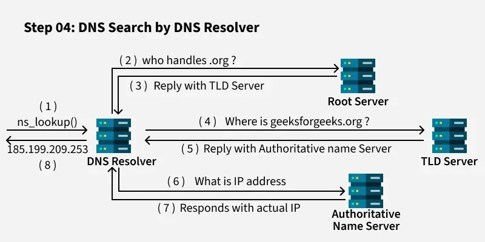

# Domain Name System (DNS)

DNS (Domain Name System) is a system that converts human-readable domain names (like google.com) into IP addresses (like 142.250.183.14) that computers use to communicate with each other. It works like the “phonebook of the internet,” allowing users to access websites using easy names instead of remembering complex numbers. DNS is a core part of internet communication and works along with protocols like User Datagram Protocol (for fast queries) and Transmission Control Protocol (for reliability in some cases). Without DNS, users would have to manually remember and enter IP addresses for every website.

It also provides flexibility for DevOps and system design, as the IP address of a server can change without affecting users—only the DNS record needs to be updated. DNS also supports features like load balancing, failover, and service discovery, which are critical in modern cloud and microservices architectures. Without DNS, managing and accessing internet services would be complex and impractical.

## Types of DNS Servers 

### 1. DNS Recursor / DNS Resolver Server / Forwarder
A DNS recursor is a DNS server that receives DNS query from client devices such as computers, phones, or browsers. When a user tries to access a website, the device sends a DNS query to this recursor asking for the IP address of the domain.

If the recursor does not already know the answer, it will contact other DNS servers (root servers, TLD servers, and authoritative servers) to find the correct IP address. After it gets the answer, it sends the result back to the client.

### 2. Root Name Server / Root Server
A Root Name Server is the top-level server in the DNS hierarchy. It is responsible for directing DNS queries to the correct Top Level Domain (TLD) servers.

When a DNS resolver tries to find the IP address of a domain name and does not already know the answer, it first contacts a Root Server. The root server does not know the final IP address of the website, but it knows which TLD server to ask next.

#### Note:
There are 13 logical root server clusters worldwide (named A–M). These root servers are replicated across hundreds of physical servers globally for reliability and performance.

### 3. Top Level Domain (TLD) Name Server
A Top Level Domain (TLD) Name Server is a DNS server responsible for managing information about domains within a specific top level domain, such as .com, .org, .net, .edu, or country domains like .uk or .jp.

TLD name servers are part of the DNS hierarchy and sit below the root name servers and above the authoritative name servers. Their main role is to direct DNS queries to the correct authoritative DNS server for a domain.

### 4. Authoritative Name Server
An Authoritative Name Server is a DNS server that contains the actual DNS records for a domain and provides the final answer to DNS queries.
Unlike root servers or TLD servers, which only direct queries to other DNS servers, the authoritative name server stores the real information about the domain, such as its IP address.

The authoritative name server stores DNS records like:

- A record: maps a domain name to an IPv4 address
- AAAA record: maps a domain name to an IPv6 address
- MX record: specifies the mail server for the domain
- CNAME record: creates an alias for a domain

When a DNS resolver asks for the IP address of a domain, the authoritative server returns the final response.

## Step by Step Working of DNS

### 1. User Request
When we type a domain name like https://www.geeksforgeeks.org/ into our browser, our computer starts the process of finding the corresponding IP address needed to connect to the website.

### 2. Check Local Cache
The first place our system looks is in its local cache, which may include:

- Browser Cache: The browser might have recently stored the IP address if we’ve visited the site before.
- Operating System (OS) Cache: The OS maintains a DNS cache to speed up lookups.
- Router Cache: Our router might also store previously requested IP addresses.

If the IP address is found in any of these caches, the process ends here and the browser connects to the website. Otherwise, the process moves forward.

### 3. Check Host Files
If the IP address is not in the local cache, the system may check host files, which are manually configured mappings of domain names to IP addresses. This is rare in modern systems, but it might still be used for certain network configurations.

### 4. Query DNS Resolver
If no IP address is found locally, the request is sent to a DNS Resolver. The Resolver is a server provided by our Internet Service Provider (ISP) or a public DNS service like Google DNS (8.8.8.8) or Cloudflare (1.1.1.1). The Resolver acts as the intermediary that communicates with various DNS servers to find the IP address.

### 5. Contact the Root Server
Resolver first contacts the Root DNS Server which is the starting point for DNS lookups. The Root server doesn’t know the exact IP address of geeksforgeeks.org but directs the query to the Top-Level Domain (TLD) Server responsible for .org.

### 6. Query TLD Server
Resolver sends the query to the TLD Server for .org domains. The TLD server handles domain names ending in .org and knows where to find the authoritative nameserver for geeksforgeeks.org.

### 7. Query the Authoritative Server
The Resolver then queries the authoritative nameserver for geeksforgeeks.org. This server is responsible for storing DNS records for the domain, including the mapping of the domain name to its IP address.

### 8. Retrieve the IP Address
Authoritative nameserver responds to the Resolver with the exact IP address (e.g., 192.0.2.1) for geeksforgeeks.org.

### 9. Return IP Address to Computer
Resolver receives the IP address from the authoritative nameserver and sends it back to our computer. At this point, our computer knows how to connect to the website.

### 10. Connect to the Real Server
With the IP address in hand, our browser sends a request to the real server that hosts geeksforgeeks.org. This server processes the request and sends the necessary data back to our browser.

### 11. Website Loads
Our browser receives the response from the real server and the website content is displayed on our screen. All of this happens in just milliseconds, making the process seamless for the user.

### TTL (Time To Live)

TTL (Time To Live) in DNS is the amount of time a DNS record is cached (stored) by DNS resolvers or browsers before they request it again from the DNS server. It is measured in seconds. For example, if a DNS record has a TTL of 300 seconds (5 minutes), then any DNS server or client will reuse the cached IP for 5 minutes instead of querying again. TTL helps reduce DNS query load and improves performance, but it also affects how quickly changes (like IP updates) are reflected across the internet in the Domain Name System.

### DNS Propagation

DNS propagation is the time it takes for DNS changes (like updating an IP address or adding a new record) to be reflected across all DNS servers worldwide. When you update a DNS record, not all users see the change immediately because many DNS servers still use the old cached value based on TTL. As the cache expires, servers fetch the updated record, and the change gradually spreads across the internet. This process can take a few minutes to up to 24–48 hours, depending on TTL and caching behavior.

### Reverse DNS Lookup

A reverse DNS lookup is the process of finding the domain name associated with a given IP address, which is the opposite of normal DNS resolution. Instead of converting a domain to an IP, reverse DNS converts an IP back to a domain name using PTR (Pointer) records in the Domain Name System. It is commonly used in email servers for spam verification, logging, security checks, and troubleshooting. For example, given an IP address like 8.8.8.8, a reverse DNS lookup might return dns.google.

## Types of DNS Records

### 1️⃣ A Record (Address Record)

An A record maps a domain name to an IPv4 address.
It tells DNS which server IP hosts the website.

#### Example:
example.com  A  192.168.1.10

#### Meaning: 
example.com → 192.168.1.10

When a user visits example.com, DNS returns 192.168.1.10, and the browser connects to that server.

#### Real Example
google.com → 142.250.183.206

#### DevOps Use Case

When you deploy a website on a server:

myapp.com → EC2 public IP

### 2️⃣ AAAA Record (IPv6 Address Record)

An AAAA record maps a domain name to an IPv6 address.

IPv6 is the new generation of IP addressing.

#### Example:

example.com   AAAA   2001:0db8:85a3::8a2e:0370:7334

#### Meaning:

example.com → IPv6 address
Why IPv6?

IPv4 addresses are limited (~4.3 billion).
IPv6 supports trillions of devices.

#### DevOps Example

Modern cloud infrastructure may support IPv6 traffic.

### 3️⃣ CNAME Record (Canonical Name)

A CNAME record creates an alias for another domain name.

It means one domain points to another domain.

#### Example:

blog.example.com   CNAME   example.com

#### Meaning:

blog.example.com → example.com

DNS will then resolve example.com to its IP address.

#### Real Example

CDN systems use CNAME.

cdn.example.com → cloudflare.net
#### DevOps Use Case

Point subdomains to services.

Example:

www.myapp.com → myapp.vercel.app

### 4️⃣ MX Record (Mail Exchange)

An MX record specifies which mail server handles emails for a domain.

#### Example:

example.com   MX   mail.example.com

#### Meaning:

Emails sent to example.com go to mail.example.com
Real Example

#### Google Workspace:

example.com MX 1 aspmx.l.google.com

example.com MX 5 alt1.aspmx.l.google.com

#### Email Flow
Send email → DNS lookup MX record → mail server

Example:

user@gmail.com → Gmail mail servers

### 5️⃣ TXT Record (Text Record)

TXT records store text information for verification and security.

They are used for:

- Domain verification
- Email security
- Ownership validation

#### Example:

example.com TXT "google-site-verification=abc123"
Common Uses
SPF (Sender Policy Framework)

Prevents email spoofing.

#### Example:

example.com TXT "v=spf1 include:_spf.google.com ~all"
DKIM

Email authentication.

Domain verification

Used by:

- Google
- AWS
- Cloudflare
- Microsoft

### 6️⃣ NS Record (Name Server)

NS records specify which DNS servers are authoritative for a domain.

#### Example:

example.com NS ns1.cloudflare.com

example.com NS ns2.cloudflare.com

#### Meaning:

These servers manage DNS records for example.com
#### Real Example

When you buy a domain:

Domain registrar → Name servers assigned

#### Example:

ns1.digitalocean.com
ns2.digitalocean.com

These servers store all DNS records.

#### DNS Record Flow Example

Suppose you type:

https://myapp.com

DNS records might look like:

| Name           | Type  | Value                              |
|----------------|-------|------------------------------------|
| myapp.com      | A     | 52.14.22.10                        |
| www.myapp.com  | CNAME | myapp.com                          |
| myapp.com      | MX    | mail.myapp.com                     |
| myapp.com      | TXT   | "v=spf1 include:_spf.google.com ~all" |
| myapp.com      | NS    | ns1.cloudflare.com                 |

## Advanced DNS Concepts

DNS is more than just name-to-IP translation. Here’s what happens in complex, high-performance, and secure environments.

### 1. CNAME Chain Resolution
Sometimes domains don’t point directly to an IP but to another domain. These are CNAME records (Canonical Names). DNS follows the chain until it hits an A (IPv4) or AAAA (IPv6) record.

Example:
`blog.mybrand.com → host.mycms.net → IP address`

### 2. DNSSEC (DNS Security Extensions)
DNSSEC adds cryptographic signatures to DNS responses to prevent tampering or spoofing. It protects against attacks like DNS cache poisoning.

### 3. EDNS Client Subnet (Geo Load Balancing)
With EDNS Client Subnet, part of your IP is shared with DNS servers. This helps return an IP of a nearby server, improving speed and reliability.

### 4. DNS over TLS/HTTPS (Transport Security)
Modern DNS systems encrypt your queries using:
- DoT (DNS over TLS) — TCP 853
- DoH (DNS over HTTPS) — TCP 443
This ensures your ISP or attackers can’t see what domains you’re resolving.

## References

https://www.geeksforgeeks.org/computer-networks/working-of-domain-name-system-dns-server/

https://www.geeksforgeeks.org/computer-networks/domain-name-system-dns-in-application-layer/

https://medium.com/@user7.9/dns-explained-the-system-that-powers-the-internet-8427a396af8c

https://medium.com/basic-command-ls-linux/how-dns-works-b49c7395c91e

https://medium.com/@mgoutham4/how-dns-works-from-basics-to-advanced-concepts-e5f44a2283fe